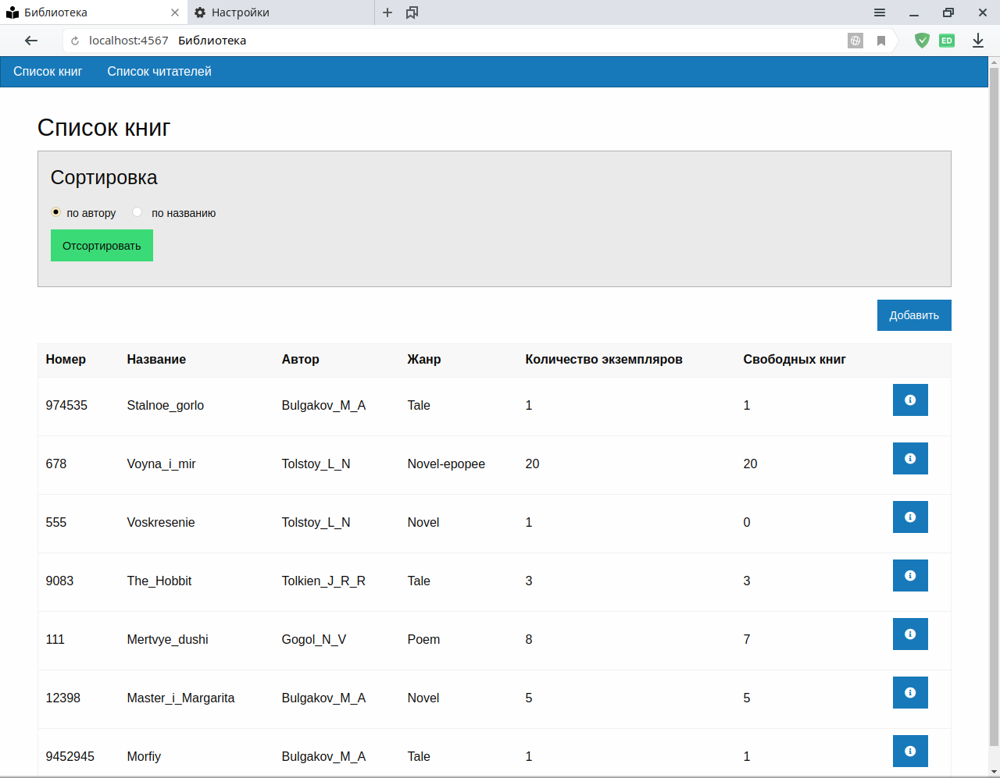
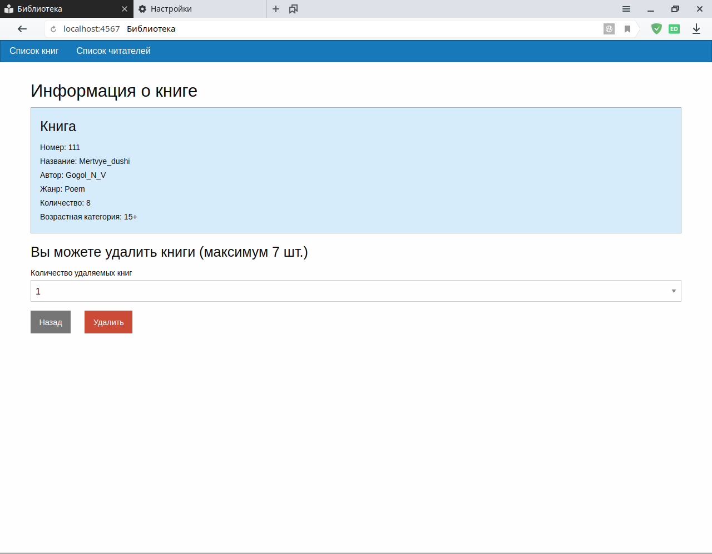
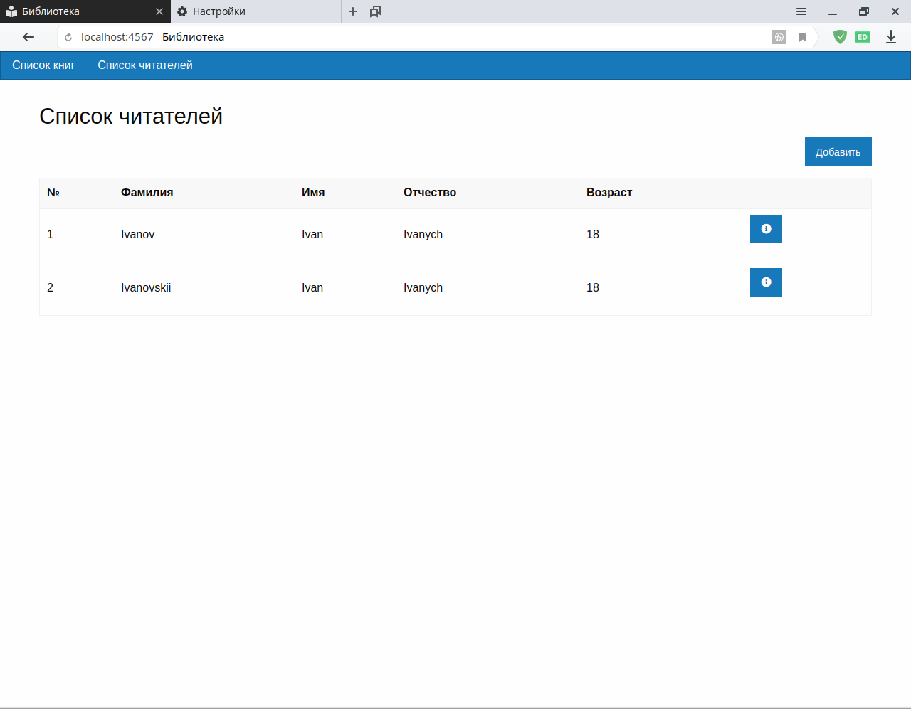
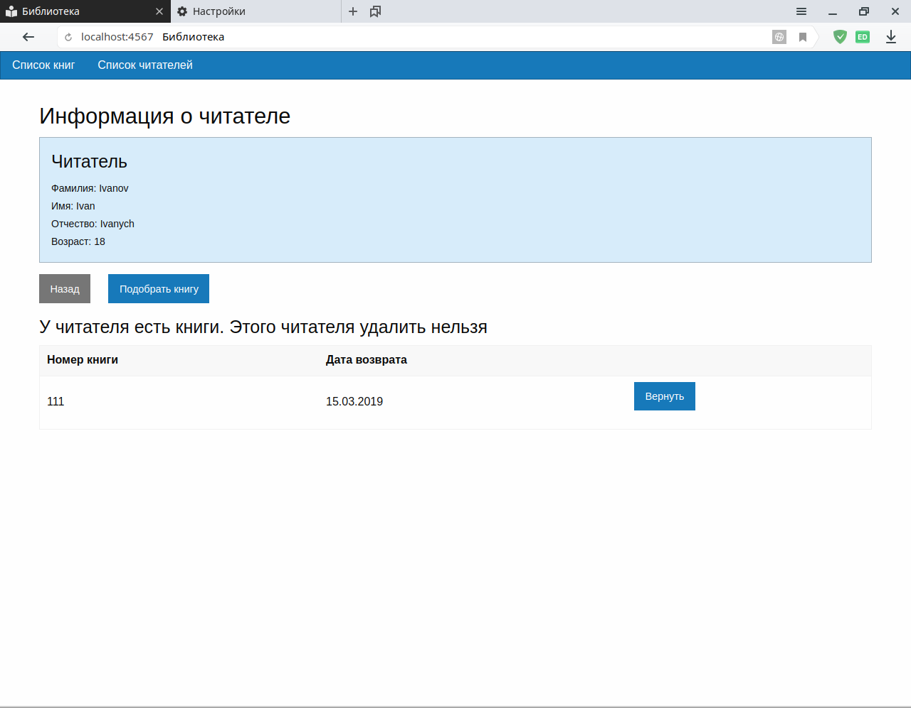
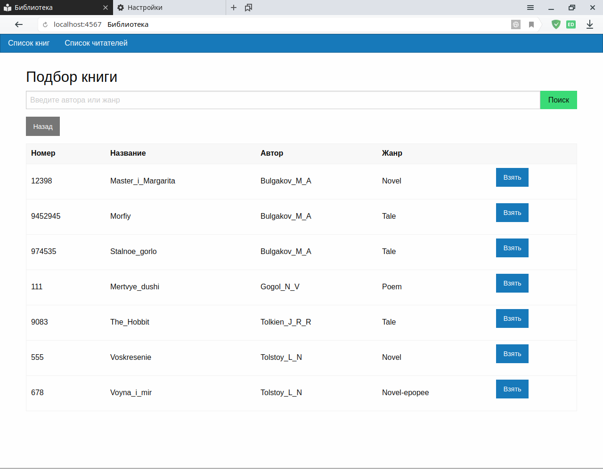
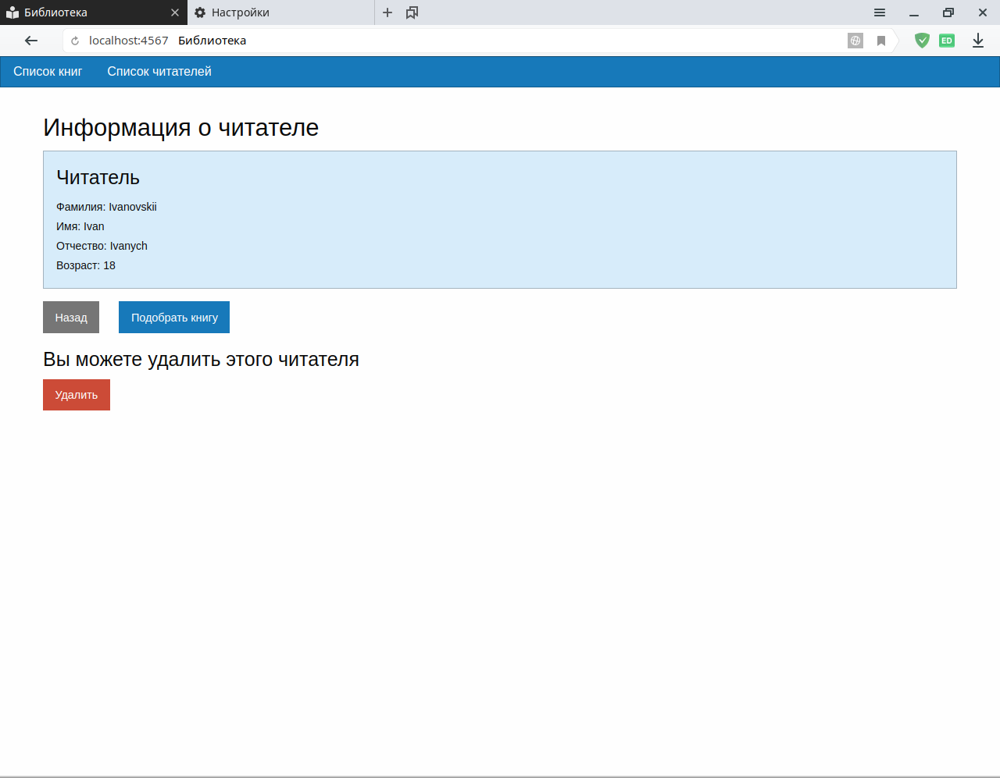

# Лабораторные работы по дисциплине "Разработка ПО на языке Ruby"

https://lms.crafted.su/ruby-course/2018-2/

### Запуск

`$ruby app.rb`

### Тестирование

`$bundle exec rspec`

## Лабораторная 1

https://lms.crafted.su/ruby-course/2018-2/labs/2018-10-04-lab1.html

### Консольное приложение

Написать программу, моделирующую информационную систему на железнодорожном вокзале. 

Сведения о каждом поезде содержат: 
* номер, 
* пункт отправления, 
* пункт назначения, 
* время отправления, 
* время прибытия, 
* стоимость билета. 

Программа должна создавать список поездов. 

Начальное формирование данных осуществляется из файла (или файлов). 

С помощью меню необходимо обеспечить следующие функции:

1. добавление поезда;
2. удаление поезда;
3. по пунктам отправления и назначения разработать маршрут поездки, возможно с пересадками;
4. вывод всех поездов по заданному пункту отправления и времени прибытия;
5. вывод всех поездов по заданному пункту отправления и назначения.

## Лабораторная 2

https://lms.crafted.su/ruby-course/2018-2/labs/2018-12-06-lab2.html

### Консольное приложение

Написать программу, моделирующую учет книг в библиотеке.

Сведения о каждой книге содержат: 
* фамилию и инициалы автора, 
* название, 
* номер, 
* жанр, 
* возраст читателя, 
* количество книг в библиотеке. 

Сведения о каждом читателе содержат: 
* фамилию, 
* имя, 
* отчество, 
* возраст, 
* список книг с указанием даты возврата.

Программа должна создавать список книг и список читателей.

Начальное формирование данных осуществляется из файла (или
файлов). 

С помощью меню необходимо обеспечить следующие
функции:
1. добавление книги или читателя;
2. удаление книги или читателя;
3. подбор книги для данного читателя по заданному жанру
или автору (с учетом возраста читателя);
4. выдачу книги читателю, при этом должно учитываться количество экземпляров книги, оставшихся в библиотеке;
5. возврат книги, за не вовремя сданную книгу рассчитывается штраф (например, 1 рубль за каждый день);
6. вывод списка книг, упорядоченного по фамилии автора;
7. вывод списка книг, упорядоченного по названию.

## Лабораторная 3

https://lms.crafted.su/ruby-course/2018-2/labs/2018-12-27.html

### Веб-приложение

Условие задачи совпадает с лабораторной 2.

---

Номер регистрации (свидетельства): [2020663020](https://www1.fips.ru/registers-doc-view/fips_servlet?DB=EVM&rn=5985&DocNumber=2020663020&TypeFile=html)

---

### Название программы для ЭВМ:
Учёт книг – веб-приложение, реализующее учет книг в библиотеке

### Реферат:
Программа реализует учет книг в библиотеке. Программа работает со списком книг и списком читателей. Сведения о каждой книге содержат: фамилию и инициалы автора, название, номер, жанр, возраст читателя, количество книг в библиотеке. Сведения о каждом читателе содержат: фамилию, имя, отчество, возраст, список книг с указанием даты возврата. Начальное формирование данных осуществляется из csv файлов. С помощью меню предоставляются следующие функции: добавление книги или читателя; удаление книги или читателя; подбор книги для данного читателя по заданному жанру или автору (с учётом возраста читателя); выдача книги читателю, при этом учитывается количество экземпляров книги, оставшихся в библиотеке; возврат книги, за не вовремя сданную книгу рассчитывается штраф; вывод списка книг, упорядоченного по фамилии автора; вывод списка книг, упорядоченного по названию. Тип ЭВМ: IBM PC-совмест. компьютер. ОС: Linux, Windows, MacOS.

### Язык программирования: 
Ruby

### Объем программы для ЭВМ: 
495 КБ

---

### Интерфейс

    

    

    

    

    

    

